# Getting Started with Rocket Enterprise Developer for Eclipse (Windows)

Rocket&reg; Enterprise Suite products provide a proprietary runtime engine to enable compatibility for customers’ IBM CICS applications. IBM and CICS are registered trademarks of International Business Machines Corp. Rocket Enterprise Suite products do not include an IBM CICS engine and are not affiliated with IBM. 


## Overview

This set of tutorials guides you through Rocket&reg; Enterprise Developer for Eclipse. They provide you with a basic understanding of how the product operates.

These tutorials are designed for developers who have experience with developing COBOL on the mainframe but do not necessarily have a working knowledge of the Eclipse Integrated Development Environment (IDE). The tutorials provide a basic understanding of the features offered in Enterprise Developer for Eclipse to develop and maintain both simple COBOL and mainframe subsystem applications.

Other tutorials, which are designed for Administrators, are also available.

* [Starting the Eclipse Integrated Development Environment (IDE)](#starting-the-eclipse-integrated-development-environment-ide)
* [Creating a Project and Adding the Source Files](#creating-a-project-and-adding-the-source-files)
* [Editing Source Files](#editing-source-files)
* [Compiling the Source Code](#unit-testing-the-batch-application)
* [Unit Testing the Batch Application](#unit-testing-the-batch-application)
* [Unit Testing the Online Application](#unit-testing-the-online-application)
* [Debugging the Batch Application](#debugging-the-batch-application)
* [Debugging the Online Application](#debugging-the-online-application)

**Download the Demonstration Application**

A preconfigured, fully executable application, BankDemo, is available from the Rocket Software GitHub repository - [*click here*](https://github.com/RocketSoftware/BankDemo). Download the sample sources as follows:

1.  In the GitHub repository for the BankDemo demonstration, click **Releases** in the right side part of the page.
2.  In the list of releases, locate and click the one that corresponds to the Enterprise Developer product release you have installed.
3.  Expand the **Assets** section and click either **Source code (zip)** or **Source code (tar.gz)** to download the archive with the sample's sources.
4.  Expand the archive on your computer.

    The demonstration application includes all the source files needed to run it. The application is both a batch and online application which assesses data on a fictitious bank system. The bank data is stored in VSAM files.

> **Important:** Before attempting this tutorial, create a directory on your machine for the sample files - for example, create a `MFETDUSER` directory on the root of your local drive (C:). Copy the entire contents from the expanded folder into the newly created directory. For example, you should have a `C:\MFETDUSER\datafiles` folder, etc.

As part of this tutorial, you use the supplied standard Eclipse COBOL project in the sample to set up a development environment for this application. The tutorials show how you can:

-   Create a project for your application
-   Edit the source files
-   Compile the source code
-   Execute and debug the application

 **Prerequisites**

You must have the following software installed:

-   Rocket Enterprise Developer for Eclipse. [*Click here*](https://docs.rocketsoftware.com/bundle?cluster=true&labelkey=prod_enterprise_developer) to access the documentation for Enterprise Developer.
-   A TN3270 terminal emulator to run the CICS application. This tutorial uses the Rocket Software Secure Host Access (SHA) TN3270 emulator, which is installed with Enterprise Developer, but you can also use an alternative terminal emulator.

**Using a Remote Enterprise Server Instance for the Tutorials**

If you have an active firewall on the machine that is running your Directory Server and enterprise server instances, and you want remote clients to be able to connect to them, you must ensure that the firewall allows access to the ports that you are using.

For example, Directory Server  is configured, by default, to use port 86. You must configure your firewall to allow TCP and UDP access to this port. Similarly, the enterprise server instance you create as part of this tutorial, BANKDEMO, has listeners which use ports 9003 and 9023. For remote clients to be able to submit JCL jobs or connect a TN3270 terminal to these listeners, your firewall must permit access to these ports.

If you want remote users to access Enterprise Server functionality through the firewall, we recommend that you use fixed port values, so that you can control access via these.

## Enterprise Server Security

In this release, the Enterprise Server security features are enabled by default. Tutorials that use enterprise server regions, however, assume that Enterprise Server security is not configured. To perform this tutorial without modification, you must disable the default configured Enterprise Server security. See *Disable the Default Enterprise Server Security Configuration* for more information.

### Disable the Default Enterprise Server Security Configuration

> **Important**: Rocket Software does not recommend disabling Enterprise Server security permanently. If you disable the default Enterprise Server security to facilitate running tutorials then this should be performed on a network isolated machine. Re-enable security as soon as possible after completing the tutorial. See *To Recreate the Default Enterprise Server Security Configuration* in the product documentation for steps on how to re-enable security. 

1. In an Enterprise Developer Command Prompt, run the command `DisableESDefaultSecurity.cmd`. You see a series of messages as the script disables default security.
2. Restart the Directory Server (MFDS) and Enterprise Server Common Web Administration (ESCWA) services to pick up the configuration changes. You can now use ESCWA without having to log in.
3. Restart any running enterprise server regions to have them pick up the configuration changes. Regions will no longer require credentials for starting or stopping and other actions.


## Starting the Eclipse Integrated Development Environment (IDE)

[Back to Top](#overview)

1. To start Enterprise Developer.

    **Windows 10**

    - Click **Start \> All Programs \> Rocket Enterprise Developer \> Enterprise Developer for Eclipse**. 
    
    **Windows 11**
    
    - Click the **Start** button in the Task Bar. Use the search field in the Start menu to find and start **Rocket Enterprise Developer > Enterprise Developer for Eclipse**.

    If you need instructions to get Enterprise Developer started on your local machine, see *To Start Enterprise Developer* in the product Help for Enterprise Developer.

    This opens the **Eclipse Launcher** which enables you to choose a location for Eclipse to store your projects.

2.  Specify the workspace folder, for example, specify `C:\MFETDUSER\tutorial\workspace` in the **Workspace** field and click **Launch**.

    If this is the first time you start Enterprise Developer, you are presented with the Eclipse **Welcome page**. Click **Open Team Developer Perspective** to close the Welcome page and see the main Eclipse window.

    If the **Welcome page** is not opened, click **Window** \> **Perspective** \> **Open Perspective** \> **Other**, select **Team Developer (default)**, and click **Open**.

    The views you see open in Eclipse and their layout depends on whether you have used Eclipse before. You can move, resize, and minimize views which is why they might not look exactly as described here. If this is the first time that you use Eclipse, you should see the following views in the IDE, although most of the views are currently empty:

    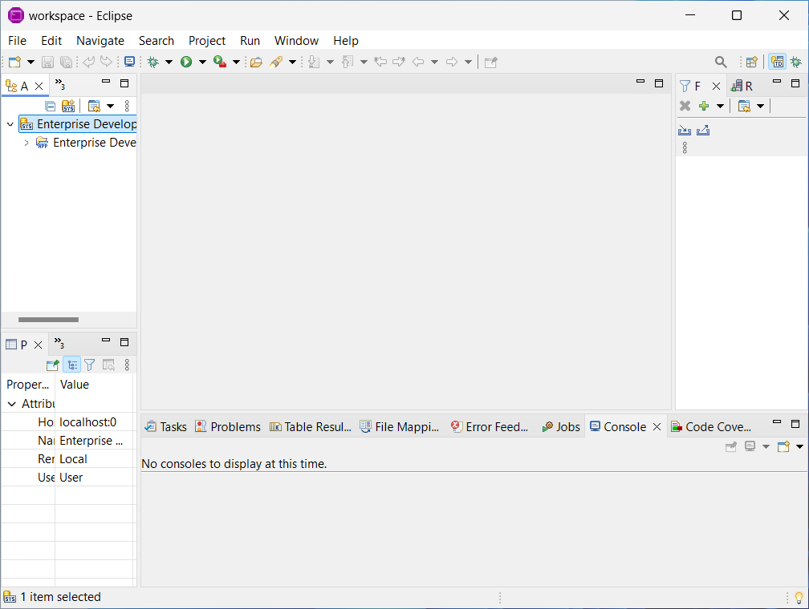

    -   The **Application Explorer** view in the upper left part of the IDE gives a logical view of your applications. You will use the **Application Explorer** view most of the time. This tree view should already display an Enterprise Developer system entry. If not, right-click in this view, select **Add System(s)**, select **ED System**, and click **OK**. This view now displays a system entry used to support the standard Enterprise Developer projects. Expand this system entry and an application entry named **Enterprise Development Projects** is displayed. Right-click this application entry and select **Load Application**. If you are using this Eclipse workspace for the first time, there are no projects associated with this application.
    -   The **Properties**, **Outline**, and **Program Outline** tabbed views in the bottom left part of the IDE provide more information about selected tree or table entries, and outline information on various types in your sources when you start editing COBOL or PL/I programs or JCL.
    -   A series of tabbed views in the bottom right part of the IDE (**Table Results** view, **Error Feedback** view, **Jobs** view, **File Mappings** view, **Console**, **Problems**, and **Tasks** views) show for example sources in a table structure, the results of compiling, and tasks.
    -   The IDE provides a **Server Explorer** view, where you can view the underlying execution environment. This view is displayed as a tab in the upper left part of the IDE.
    -   The **Filter Definitions** view in the upper right part of the IDE is used to manage search criteria within a loaded application.
    -   The **Remote Systems** view is used to connect to the mainframe system z/OS and provides access to all mainframe resources like MVS or USS files and MVS jobs. This view is displayed as a tab in the upper right part of the IDE.
    -   The main activity window in the top middle part of the IDE, the editor, is where you edit or debug the sources.
    -   Apart from the Eclipse menus, there are a number of buttons on the toolbar, which vary depending on what you are currently doing with Eclipse.

3.  Experiment with resizing, minimizing, and restoring the views.
4.  If you close a view, click **Window** \> **Show View** \> **View Name** to restore it.
5.  At any time, you can reset the complete layout of the Team Developer perspective to its default using **Window \> Perspective \> Reset Perspective**.

### Connect to the Default ESCWA Server

Ensure that **Server Explorer** contains a connection to the default Enterprise Server Common Web Administration (ESCWA) server. Note that existing workspaces might already have this connection.

1. In the **Server Explorer** view, right-click and select **New > Enterprise Server Common Web Administration Connection**.
    
    The **New Enterprise Server Common Web Administration Connection** dialog box opens.

2. In the **Name** field, type `Local`.
3. In the **Server address** field, type `localhost`.
4. In the **Server port** field, leave the default port value 10086.
5. If the server connection is TLS-enabled, select **TLS Enabled**, click **Browse**, and select the appropriate certificate.

> **Note**: If **TLS Enabled** is selected, but you do not specify a certificate, the default Java keystore is searched for a valid one.

6. Click **Finish**.

The new ESCWA connection is displayed at the top level, in the **Server Explorer**.

## Creating a Project and Adding the Source Files

[Back to Top](#overview)

You will use the project supplied with the BankDemo sample as a template to create a project for this demonstration. You will then add the source files to the projects to be able to build, develop and test the application.

The source files of the demonstration application are stored in subfolders named after the file type (for example, `bms`, `cobol`, `copybook`, `jcl`) in the `C:\MFETDUSER\sources` directory. The data files are in `C:\MFETDUSER\datafiles`.

**Creating the Project for the Bankdemo Application**

You use the Bankdemo project supplied with the sample to create your project in the Eclipse workspace that has the same settings as the sample project:

1.  In the **Application Explorer** view, right-click **Enterprise Development Projects**, which is the node for the standard application.
2.  Click **New COBOL Project \> COBOL Project from Template**.

    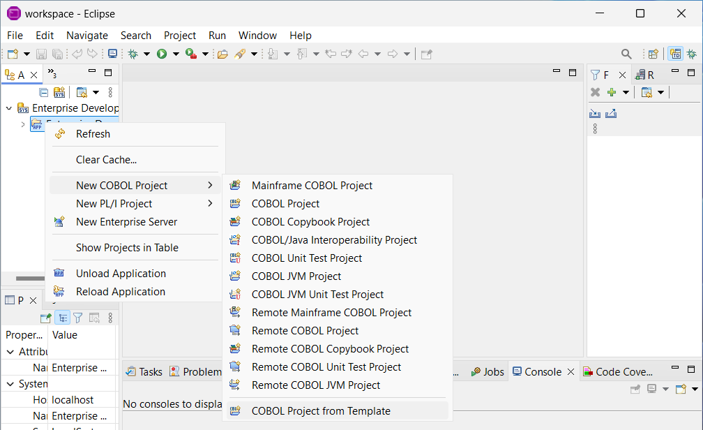

3.  Enter the template parameters:

    a.  Click **Retrieve** next to **Template Path**.

    b.  Browse to the `C:\MFETDUSER\tutorial\projects\Eclipse\cobol\Bankdemo` folder and click **Select Folder**.

    c.  Type `Bankdemo` in the project name field and click **OK**.

    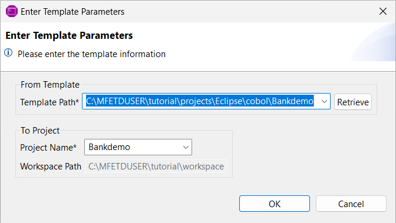

    This creates a copy of the Bankdemo project in your Eclipse workspace and adds the project to the application in the **Application Explorer** view. If the Bankdemo project entry is not displayed in the tree view, refresh the **Enterprise Development Projects** entry.


4.  Expand the Bankdemo project in the **Application Explorer** view.

    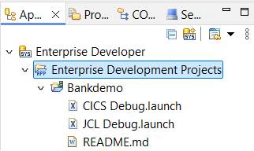

**The Bankdemo Project**

Your project is preconfigured so that the build process creates the output files in a location that is used by the Enterprise Server logical server. To check which folder will include the built files:

1.  In the **Application Explorer** view, right-click the **Bankdemo** project and click **Properties**.
2.  Expand **Rocket Software \> Build Configurations** and then click **Link**.

    The project comes with a predefined configuration called **loadlib**.

3.  Note that the **Output path** field points to the `loadlib` directory which will be created in the project directory at build time.
4.  You can click **Cancel** on the **Project Properties** dialog box.

**Adding the Demo Source Files**

In most cases, to add files to an Eclipse project, you use the **Import** command. This creates local copies of file sources in the workspace. Optionally, you can leave the source files in the original location and create links to them which is what you will do in this tutorial.

To add the sample copybooks to the project:

1.  In **Application Explorer** view, right-click the **Bankdemo** project and click **New** \> **Folder\> Folder**.
2.  Click **Advanced** and select **Link to alternate location (Linked Folder)**.
3.  Browse to `C:\MFETDUSER\sources\copybook` and click **Select Folder**.
4.  Click **Finish**.

    This adds the folder storing the copybooks to your project as a linked resource.

By default, Eclipse is set to build projects automatically (see **Project** \> **Build Automatically**), so it immediately compiles the files you just added.

To add the other source files to the Bankdemo project:

1.  In **Application Explorer** view, right-click the **Bankdemo** project and click **New** \> **Folder\> Folder**.
2.  Click **Advanced** and select **Link to alternate location (Linked Folder)**.
3.  Browse to `C:\MFETDUSER\sources\cobol` and click **Select Folder**.
4.  Click **Finish**.

    This adds the folders storing the source files to your project as linked resources:

    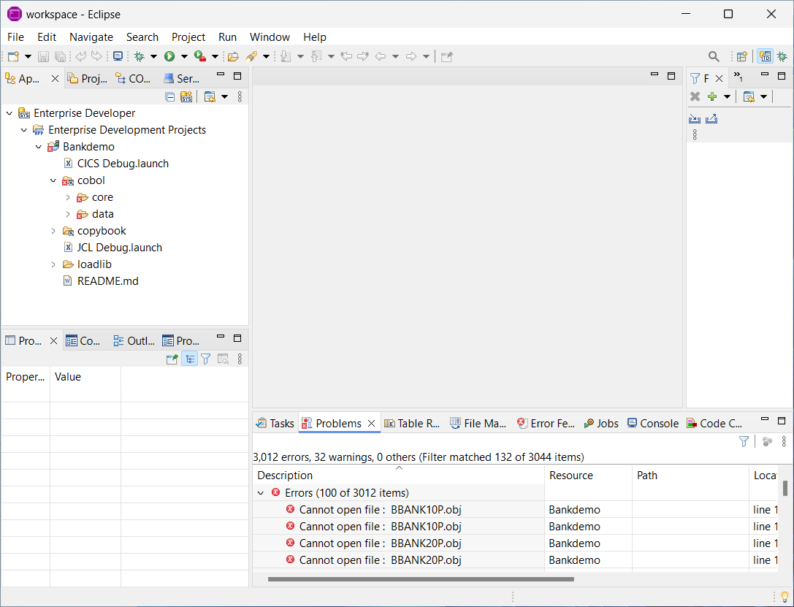

    Again, Eclipse immediately compiles the files you have just added.

    Check the **Console** and **Problems** views and see that some of the programs failed to compile. In the **Application Explorer** view, you can select a program and check the error and warning count property in the **Properties** view to indicate that there are compilation problems. The errors are due to the correct copybook paths not being specified in the project's properties.

5.  Repeat the steps above to add the files from the `C:\MFETDUSER\sources\bms` and the `C:\MFETDUSER\sources\jcl` folders as linked resources.

**Specifying the Copybook Paths for the Bankdemo Project**

Next, specify the copybook paths for the project so that the copybook dependencies get resolved:

1.  In **Application Explorer** view, right-click the **Bankdemo** project and click **Properties**.
2.  Expand **Rocket Software** and then click **Build Path**.
3.  Click the **Dependency Paths** tab and ensure that **Type** is set to **COBOL Copybook Paths**.
4.  Select the check box in front of **Bankdemo/copybook**.
5.  Click the **Build Precedence** tab and click **Deselect All** in the right side of the dialog box.

    You do not have to compile all source files for this demonstration, so you only have to enable some of the folders on this page.

6.  Select the check boxes for the following folders:
    -   **Bankdemo/bms/cobol**
    -   **Bankdemo/cobol/core** 
    -   **Bankdemo/cobol/data/vsam**

7. Click **Apply and Close**. 

    Eclipse rebuilds the project. There are still a few issues that are reported.

**Setting Compiler Directives**

You now must perform a scan of the COBOL programs in your project to determine and set the appropriate Compiler directives:

1.  Right-click the **Bankdemo** project and click **Determine Directives**.

    The IDE performs a scan of the files and shows a report of which directives for dialect and for CICS must be set on the programs in your project so that they compile cleanly.

    

2.  Click **Apply** to set the directives.

    If you are prompted to delete some user files, choose **No**.

    Setting the missing Compiler directives triggers a full rebuild of the project. The project should compile cleanly now.

**Adding Data Files**

The demonstration application includes a number of data files. To see how you can edit data files, you can only look at one of these files, so there is no need to create a folder for it in the project. To add the data file to your project:

1.  In the **Application Explorer** view, right-click the Bankdemo project and click **New** \> **File** \> **Other File**.
2.  Click **Advanced** and select **Link to file in the file system**.
3.  Browse to the `C:\MFETDUSER\datafiles` folder.
4.  Select **MFI01V.MFIDEMO.BNKACC.dat** and click **Open**.
5.  Click **Finish**.

    This adds the file to the Bankdemo project and also automatically opens it in the Rocket Data File Tools utility. You can close the utility for now.

6.  Repeat steps 1 to 4 to add the `MFI01V.MFIDEMO.BNKACC.str` file to the project.

**Summary**

You created an Eclipse project and added references in it to the COBOL files, the copybooks, the BMS, and the JCL files of the demonstration program. Next, you will edit some of these source files.

## Editing Source Files

[Back to Top](#overview)

This topic describes the editing features for the various file types (COBOL, JCL, IMS, BMS, and data files).

> **Important:** We recommend that you create backup copies of all files before you start editing them.


**Editing COBOL Files**

You will explore some of the COBOL editing features using the `ZBNKPRT1.cbl` program which produces a report from a sequential data file.

1.  In the **Application Explorer** view, in the `cobol > core` folder of the project, double-click **ZBNKPRT1.cbl**.

    This opens the file in the COBOL editor in Eclipse. Next, you will enable the line numbers in the editor.

2.  Click **Window \> Preferences** to open the Eclipse preferences.
3.  Expand **General \> Editor** and click **Text Editors**.
4.  Select the **Show Line Numbers** check box and click **Apply and Close**.

**Copybooks** 
    
Scroll down the file until you see some COPY statements. Click on line 58 for the COPY CTIMERD statement.

1. Press **F4** to open the file in **COBOL Copy View**, which shows the code of the copybooks expanded in source file.

   The **COBOL Copy View** is read-only, and you cannot edit the code in it. The screen background changes from white to pale yellow.

    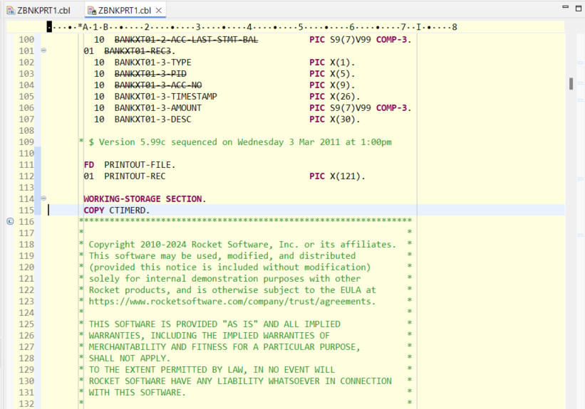

2. Press **Ctrl+F4** to close the **COBOL Copy View**.
3. To edit a copybook, position the cursor on the COPY statement and press **F3** (**Go To Definition**).

     This opens the copybook file in a new tab in the editor.

**Copybook Dependencies** 

By expanding a source file node in the **Application Explorer** view, you can see a list of all copybooks referenced in the source code, and nested within them any other copybooks referenced by those copybooks. Double-click a copybook to open it in the editor.


Use the **Copybook Dependency** view to show where in the source file structure the COPY statements are located, and which copybooks they reference. If the **Copybook Dependency** view is not displayed in the Team Developer perspective, to open this view click **Window \> Show View \> Other \> Rocket Software \> Copybook Dependency**.


Click a copybook reference in the **Copybook Dependency** view to locate the associated COPY statement at the appropriate line in the source code.

**Unused Data**

Notice that some data items in the Data Division are crossed out. This is because they are not referenced in the Procedure Division.


**Program Outline**

1. Right-click anywhere in the COBOL editor and select **Quick Outline**. This opens a pop-up with the outline of the program similar to what the **Outline** view shows. 
2. Press **Ctrl+O** in the pop-up to see a more detailed outline similar to the **Program Outline** view. 
3. Click an item in the outline to see how the cursor positions itself on the line of code that this outline item refers to. 
4. Click in the permanent **Outline** view.


5.  Expand and collapse various lines in the **Outline** view.
6.  Click items in the **Outline** view to see how the cursor positions itself on the respective line of code that each one of these outline items refers to and highlights the referenced item in the editor window.

    
7. Click  (**Sort**) in the **Outline** view to toggle between a physical or alphabetical sequence.

**Hyperlinks** 

1. In the editor, scroll down the file to a line in the Procedure Division.
2. Press and hold the **Ctrl** button and hover over the code. 

This turns the data items and the paragraph names you hover over into hyperlinks.


3. Click a hyperlink to position the cursor on the definition of the respective data item or paragraph.                                                                             

**Viewing Data Definitions**

1. Hover over a data item in the Procedure Division to see information about the data item and how many times it is used in the program. 
2. Double-click a data item or paragraph name to see how the IDE highlights all their occurrences in the code.

**Breadcrumbs**              
The  (**Toggle Context Breadcrumbs** icon) on the toolbar lets you see another view of the program showing the copybooks. 
1. Click the icon to enable breadcrumbs. This opens a new toolbar in the editor with the name of your COBOL program.


2. Click the arrow to the right of the program name to see a list of copybooks the program uses.
3. Click one of these copybooks to load it in a new tab in the editor.

**Marking Text and Block Mode**

You can either use the mouse to mark a block of text or click  (**Toggle Block Selection Mode**) and select square blocks of text. When a selection is made, you can cut or copy it. 

**Rename** 

You can use rename refactoring to rename all occurrences of a variable:

1.  Scroll down to line 228 in the `ZBNKPRT1.cbl` file.
2.  Click WS-EXEC-PARM-LL in the editor, right-click it, and click **Refactor \> Rename**.

    A pop-up is displayed prompting you to enter a new name for the variable.
    


3. Click the down arrow to show the context menu, and click **Open Rename Dialog**.
4. Specify WS-EXEC-PARM-NEW as a **New name** in the dialog box and click **Preview**.

   This opens the **Rename COBOL Element** dialog box that enables you to preview and approve all changes.

5.  Click **Cancel** as you are not going to apply these changes for this demo.

    You can change your Eclipse preferences and rename without the **Rename COBOL Element** dialog box. To do this, go to **Window \> Preferences**, navigate to **Rocket Software \> COBOL \> Editor**, and deselect the **Rename in editor without dialog** check box.


**Smart Editing**

Next, you will look at the smart editing feature with background COBOL parsing. First, check the IDE preferences for suggestions that Content Assist offers you in the editor:

1.  Click **Window \> Preferences** and navigate to **Rocket Software \> COBOL \> Editor \> Content Assist**.
2.  Select **Enable auto activation** and click **Apply and Close**.
3.  Scroll down to line 258 in the code and start typing the following, starting in area A of the code, one character at a time:
    
    ```
    MOVE W TO
    ```
    Notice how the words you type change in the editor. Once a word is recognized as a reserved word or a data item, its color changes. If a line of code contains invalid COBOL syntax, a red cross appears to the left of the line and the word is underlined with a wavy red line.

    Also, Content Assist automatically displays a pop-up with suggested keywords and names of data items as you type.

4.  Change the line to:
    ```
    MOVE 34 TO WS-
    ```
    If the IDE preferences for auto-activation of Content Assist have not been changed, Content Assist opens a list of potential data names that start with WS- to choose from. If Content Assist does not display a list, to open it manually press **Ctrl+Space**.

5. Finally, if you have changed this COBOL program, copy the backup version back in again.

**Renumbering the COBOL Sources**

You can use the commands **Renumber** and **Unnumber** to insert and remove line numbers from your code. 

If your sources include any comments beyond column 73, you must configure the line numbering to ensure that you only apply changes to the COBOL sequence area. Here is how you can do this:

1.  Click **Window \> Preferences** and navigate to **Rocket Software \> COBOL \> Editor \> Line Numbering**.
2.  Ensure that only the **COBOL (left-hand margin)** option is enabled.
3.  Click **Apply and Close**.

To insert the line numbers in your code:

1.  Right-click the **ZBNKPRT1.cbl** file in the editor and select **Source** \> **Renumber**.

    Alternatively, on the Eclipse toolbar, click .

2.  Click **Yes** to confirm.

    This inserts line numbers in the COBOL sequence area.

    

You can now remove the line numbers from your code:

1.  Right-click the **ZBNKPRT1.cbl** file in the editor and select **Source** \> **Unnumber**. 

    Alternatively, on the Eclipse toolbar, click .
2.  Click **Yes** to confirm.

    This removes the line numbers from the COBOL sequence area.

To insert line numbers beyond the end of area B:

1.  In the IDE preferences for line numbering, select **Standard (right-hand margin)**.
2.  Click **Apply and Close**.
3.  Right-click the **ZBNKPRT1.cbl** file in the editor and select **Source** \> **Renumber**.
4.  Click **Yes** to confirm.

    You should now see line numbers running down both sides of the source code:

    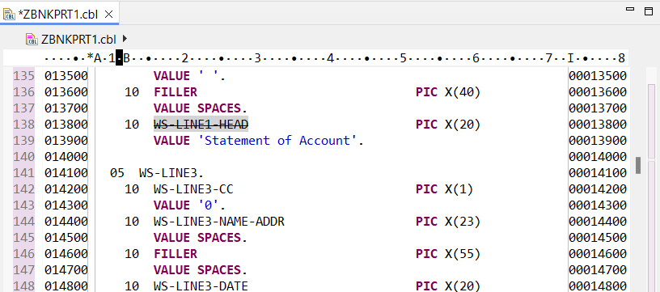

5.  Click **Edit \> Undo Typing** as necessary to revert your changes to the file.

**JCL Editing**

 -  Double-click the **ZBNKSTMT.jcl** file in the Bankdemo project to open it in the associated editor.

The editor supports background parsing, syntax checking, content assist and an outline view like the COBOL Editor does.

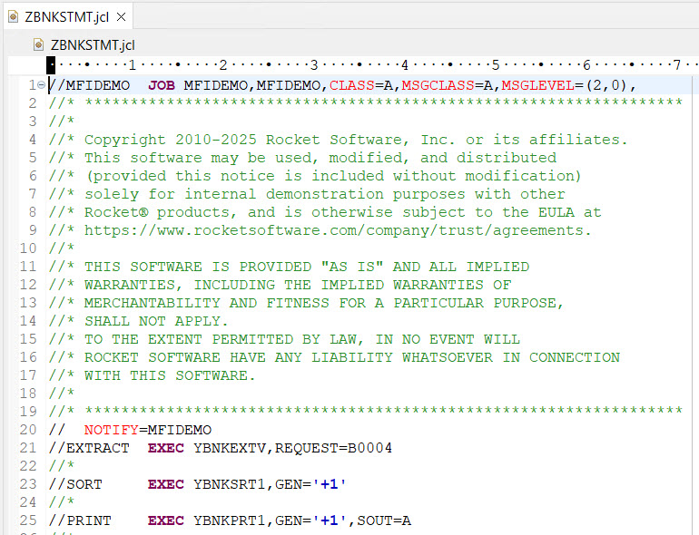

**BMS Editing**

There are two ways to edit BMS files. The first one is to use a BMS text editor available in the IDE. The other is to use a WYSIWYG version, the Rocket&reg; BMS Painter, which is available as a separate utility installed with this product.

To open the BMS file in the text editor inside Eclipse:

- In the **Application Explorer** view, go to the **bms\\cobol** folder of your project, right-click **MBANK10.bms**, and select **Open With** \> **BMS Text Editor**.

Although you can use this basic text editor to make small changes, it is quite difficult to edit BMS files in text view.

A much more suitable and less error-prone way to edit BMS files is to use the BMS Painter.

1.  Close the BMS text editor.
2.  In the **Application Explorer** view, go to the **bms\\cobol** folder of your project, right-click **MBANK10.bms** and select **Open With** \> **BMS Paint**.

    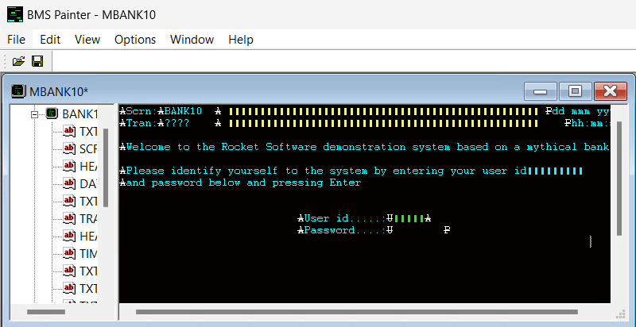
    
    This starts the external Rocket BMS Painter.

3.  In BMS Painter, you can click fields and move them by dragging.

    For example, double-click the data field immediately following the text “User Id”, and move it to a different position on the map.

4.  To add a field, click in the desired place in the window, and start typing.
5.  To change a field's properties, right-click it, and select **Properties**.
6.  To change the properties of the map or mapset, right-click the item, and select **Properties**.

    For example, do this for the MBANK10 mapset and the BANK10A map.

7.  Click **File** \> **Exit** to close the utility and do not save the file.

You can also explore your BMS maps and mapsets in the **BMS Preview** view:

1.  Open `MBANK10.bms` in the BMS text editor.
2.  On the Eclipse toolbar, click  (**Toggle the BMS previewer view**) to start the **BMS Preview** view.

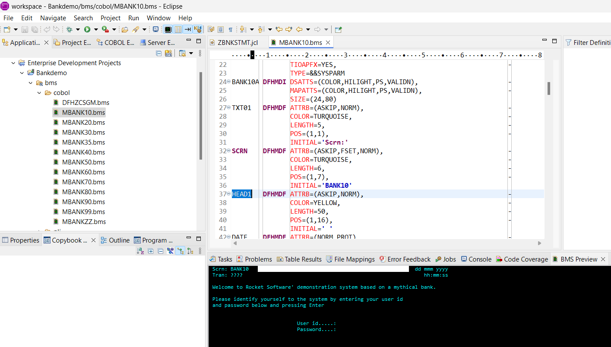

3.  In addition, you can open the **Outline** view to see the maps within the MBANK10 mapset.

    

4.  Experiment by double-clicking on various fields in the BMS file in the text editor.

    Notice how the respective fields are highlighted in the **BMS Preview** and in the **Outline** view.

    For more information about the **BMS Preview** view, check your product Help.

**Editing Data Files**

Next, you can edit the data file using the Rocket&reg; Software Data File Tools:

1.  In the **Application Explorer** view, right-click the **.dat** file and select **Open With** \> **Data File Tools**.

    This starts the **Data File Editor** and loads the **.dat** file in the **Open Data File** dialog box.

2.  Click **Open Exclusive** to load the file.
3.  **Data File Tools** loads the data file and shows two views:
    -   The left pane shows the raw form of the file. Because many of the fields are COMP-3 fields, the data in these fields is presented in an ASCII view.
    -   The right pane shows the record layout for the file in its detailed field view and the COMP-3 fields are shown in a user-friendly, editable form.

    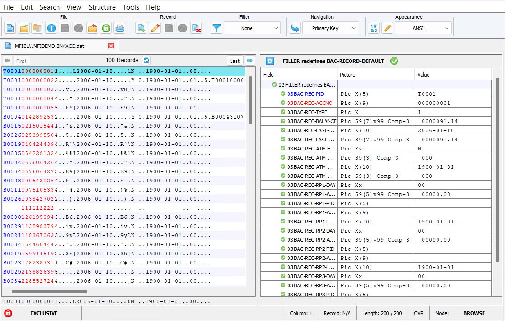

4.  Change the value of BAC-REC-BALANCE from 91.14 to 132.76 as follows: 

    a. In the right pane, click the line for BAC-REC-BALANCE, and then click  **Edit Record**.

       This highlights the record.

    b.  Double-click in the **Value** field for BAC-REC-BALANCE.
    
    c. Use the arrow keys to move the cursor inside the **Value** field. 

    d. Type `132.76` then click , **Save Record**.

    e. Confirm that you want to save the changes to this record.
    
    f. Using the same method, restore the previous value of BAC-REC-BALANCE: 91.14. 
    
5. Close the Data File Tools utility.

## Compiling the Source Code

[Back to Top](#overview)

By default, the Eclipse IDE is set to build projects automatically. Whenever you add new COBOL or BMS files to the Bankdemo project, the IDE starts an automatic build (compilation).

> **Important:** You need Enterprise Developer or Enterprise Developer for z Systems to create executables. Building projects is not supported in Enterprise Developer Connect.

To turn the automatic build off:

-   Click **Project** and disable **Build Automatically**.

To start a build manually:

-   Click **Project** \> **Build Project**.

The build in this case checks for any files that have changed and does two things:

-   Compiles any files affected by the changes
-   Relinks the built files if necessary 

To turn the automatic build on:

-   Click **Project** and enable **Build Automatically**.

**COBOL Compiler Control**

The Rocket COBOL Compiler can compile many different COBOL dialect variations. It can also compile COBOL code that contains `EXEC CICS` or `EXEC SQL` statements. The Compiler is controlled through a series of directives which are passed to the Compiler at build time. You can set directives at either a project or component level.

Often the directives can be set only at the project level, which means that all component files in the project use them. Sometimes, you have a component which you must compile with different directives. In this case, you can set the directives at the component level which overrides the project settings.

For example, most of the programs in your project could be using Enterprise COBOL for z/OS and only a few could use VS COBOL II. In this case, you would set directives for Enterprise COBOL for z/OS at the project level, and VS COBOL II at the respective COBOL programs levels.

The Bankdemo application already has the required Compiler directives set on the files. At build time, the IDE invokes the COBOL Compiler to compile the sources and create a number of files. These built files can vary, but each COBOL program in the Bankdemo application compiles to produce the following three types of files:

| **File type**               | **Function**                                                             |
|-----------------------------|--------------------------------------------------------------------------|
| `.dll` - dynamic link library | Effectively the executable module the Compiler creates for each program. |
| `.idy` - debugger information | The file created by the Compiler which allows debugging of the module.   |
| `.obj` - object file          | A temporary file the Compiler creates while producing the .dll file.     |

**BMS Compiler Control**

In the same way as for COBOL, the BMS compilation is controlled both at project and at component level.

The BMS Compiler produces the following two types of files:

| **File type**         | **Function**                                                                                  |
|-----------------------|-----------------------------------------------------------------------------------------------|
| `.mod` - BMS executable | A file created by the BMS Compiler which is the executable module relating to the BMS source. |
| `.cpy` - copybook       | A copybook that contains the BMS mapping for use in a COBOL program.                          |

**Producing a Compiler Listing**

You can configure the IDE to create a fully expanded Compiler listing file during the build. The following is also an example of setting a directive at component level:

1.  In the **Application Explorer** view, right-click **ZBNKPRT1.cbl** and click **Properties**.
2.  Click **COBOL** in the left pane and select **Enable file specific settings**.
3.  Set **Generate listing file** to **Yes** and then click **Apply and Close**.

During the build, the Compiler produces a source listing file, `ZBNKPRT1.lst`, in a Listing subfolder in the project directory (`C:\MFETDUSER\tutorial\workspace\Bankdemo\Listing` in this case). The listing file includes a fully expanded source file together with some Compiler system information at the start and with any Compiler errors highlighted with asterisks.

You can view this listing from within the IDE: double-click the **.lst** file in the `Listing` folder of your project.

**Example of Compiling a COBOL Program with Errors**

You can introduce some Compiler errors into one of the programs to see how the Compiler handles them.

1.  In the **Application Explorer** view, double-click **ZBNKPRT1.cbl**.
2.  Scroll down the program a few pages to the start of the Procedure Division around line 224.
3.  Introduce a few syntax errors as follows:

    - On line 226 change RUN-TIME to RUN-TME

    - On line 229 change SPACES to SPOCES

    - On line 237 place a period after the END-IF

    - Move one of the copybooks, `CTIMERD.cpy`, from the `copybook` folder to the `jcl` folder - right-click the file in **Application Explorer**, click **Move**, select the folder to move this to, and click **OK**.

    This triggers a build of the project which also updates the listing file. The messages in the **Console** view indicate that there are build errors.

    The errors are underlined with red wavy lines and a colored bar is added to the left of each line that includes an error.

4.  Hover over an underlined item to view a pop-up with an explanation of what the error is.
5.  Save the program.
6.  Click the **Problems** tab to view the list of errors.

    If it is hidden, you can open it by clicking **Window** \> **Show View** \> **Problems**.

    **Tip:** Click the column headings to sort the list into an appropriate order. For example, click the **Program** heading to order the errors by program.

7.  Double-click an error in the list to position the cursor on the line of code that contains the error.
8.  To fix the copybook error:
    
    a.  Locate the error related to the unknown copybook in the **Problems** view.

    b.  Right-click the line for the error and select **Quick Fix**.

    c.  In the **Quick Fix** window, select **Enable copybook path entry for directory containing CTIMERD**, and click **Finish**. You see  a message that the directory containing the copybook is not on the copybook path for the project.

    d.  Click **Yes** to add the `Bankdemo > jcl` folder where you moved the copybook to the copybook path of the project.

    This triggers a rebuild of the project which now compiles cleanly as it now locates the copybook.

9.  Check the errors in the listing file, `ZBNKPRT1.lst`, as follows:
     
    -  Double-click the `.lst` file in the `Listing` folder.

        The lines that include syntax errors are marked with double asterisks (\*\*).
        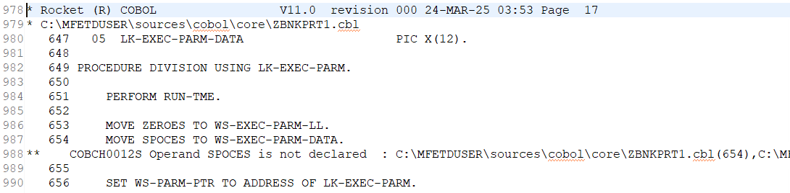

10. In the IDE, fix the errors in `ZBNKPRT1.cbl`, and save the file.

    There should be no errors in the build now.

> **Note:** Move the copybook back to its original directory in case other projects are expecting to locate it there.

## Unit Testing the Batch Application

[Back to Top](#overview)

The first thing you must do is check that the Bankdemo application is executing correctly.

To execute the JCL, run the application in an instance of the Rocket Enterprise Server (sometimes abbreviated to Enterprise Server). This demonstration includes a preconfigured enterprise server instance called BANKDEMO which you must import in Enterprise Server and start before you execute the Bankdemo application.

> **Important:** You need Enterprise Developer or Enterprise Developer for z Systems to execute the application as running applications is not supported in Enterprise Developer Connect.

Before you proceed, ensure that the default settings are applied to the Directory Sever:

1.  From the Windows **Start** menu, open the Services application. Navigate to the Directory Server service to view its status and set it to **Running** if it is not already started.

2.  In Eclipse, click the **Server Explorer** view.

    If the window is not visible, click **Window** \> **Show View** \> **Other**, then expand **Rocket Software**, click **Server Explorer**, and click **Open**.

3.  Click **Default [127.0.0.1:86]** and in the Properties pane, check the value of the directory server field. If it does not say Default, right-click the value and select **Restore Default Value**.

**Importing the Bankdemo Server**

This sample provides a PowerShell script that creates the region definition to use in this tutorial.

1.  Open Windows PowerShell and navigate to the `C:\MFETDUSER\tutorial` folder.
2.  Run `set-ExecutionPolicy RemoteSigned -Scope CurrentUser`.
3.  (Optional) Unblock the script.

    At times, for security reasons, when you have downloaded files by using a browser, the files can be blocked and you might not be able to run the script. To unblock the script:

    a. Open File Explorer and navigate to the `C:\MFETDUSER\tutorial` folder.

    b. Right-click the **createdefinition.ps1** file and select **Properties**.

    c. Select the **Unblock** check box and click **Apply**. 

4.  Run the PowerShell script provided with the sample: `.\createdefinition.ps1`. 

This runs the script and creates the Enterprise Server region definition file, `BANKDEMO.xml`, in the same folder. The file is configured for the location in which you saved the sample files.

If you cannot use the PowerShell script to create the `BANKDEMO.xml` file, you can create it manually.

1. Create an empty `BANKDEMO.xml` file.
2. Open the file in a text editor and copy the contents from the `BANKDEMO.template` file to the `BANKDEMO.xml` file.
3. In the `BANKROOT=__IMPORT_FILE_DIR__/..` value pair, manually edit `_IMPORT_FILE_DIR` and replace it with the path to the `tutorial` directory. 

   If you imported the tutorial files to the `MFETDUSER` folder, the directory name would be `C:\MFETDUSER\tutorial/..`.   

Now you can import the definition of the BANKDEMO logical server (LSER) in Enterprise Server:

1.  In Eclipse, click the **Server Explorer** view.
2.  Right-click **Default [127.0.0.1:86]** and click **Import Server**.
3.  In the **Import Server** dialog box, click **Browse** for **Import file**.
4.  Set the file extension field to **.xml**.
5.  Browse to the `C:\MFETDUSER\tutorial` folder, select **BANKDEMO.xml**, click **Open**, and then click **Finish**.

    Check the **Console** view for the results of importing the server. 
    
    

    In the **Server Explorer**, under **Default [127.0.0.1:86]**, you should now see a server called BANKDEMO. If the server is not visible, right-click **Default [127.0.0.1:86]** and click **Refresh**.

> **Note**: If you encounter issues with importing the server definition file, open the `BANKDEMO.xml` file and check if BANKROOT is set to a valid path, such as `C:\MFETDUSER\tutorial/..`. If not, edit the path manually.
 

**Associate the BANKDEMO Enterprise Server with Your Project**

You must associate your application with the BANKDEMO server. This ensures that the project's `loadlib` directory is used by the BANKDEMO enterprise server. BANKDEMO is configured to use the \$IDE_LOADLIB environment variable as the first location in the search path and, when the IDE starts the server, then \$IDE_LOADLIB is set to the output directories of any project associated with the server.

-  Right-click the **BANKDEMO** server and select **Associate with project \> Bankdemo**.

   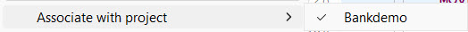

**Configure the IDE Settings for Enterprise Server**

Configure the IDE to start the associated BANKDEMO server automatically as follows:

1.  Click **Window** \> **Preferences**.
2.  Expand **Rocket Software** and click **Enterprise Server**.
3.  Set the following options on this page to **Always** to enable the IDE to start or stop the associated server, and to enable dynamic debugging, for when it is not enabled in the server:

    - **Automatically start the associated server** - this ensures the IDE will start the server if it is not running when you execute the application.

    - **Automatically stop servers started by Eclipse when closing Eclipse** - this enables the IDE to stop servers when you close Eclipse.

    - **Automatically enable dynamic debugging** - this ensures the IDE will check whether the server has dynamic debugging enabled and, if it is not, will enable it when you start debugging.

4.  Click **Apply and Close**.

**Starting the BANKDEMO Enterprise Server and Showing the Server Log**

These are the steps to start the server manually, and are included for completeness. You do not have to start the server manually, as you have configured the IDE to start the server automatically.

1.  In **Server Explorer**, right-click **BANKDEMO**, then click **Start**.

    > **Note:** You might receive an **ESMAC Sign On** dialog prompting you to provide connection details for the BANKDEMO server. This is a standard security dialog. Click **OK** without specifying any sign on details. Also, you can skip enabling password recovery.

    You might also receive a **Windows Security Alert** blocking the **MF Communications** process. Click **Allow access**.

    You can check the **Console** view to ensure that the BANKDEMO server has started successfully.

2.  In **Server Explorer**, right-click the BANKDEMO server and click **Show Console Log**.

    Check the **Console** view as it now shows the messages from the server log:

    

3.  Right-click the BANKDEMO server again, and then click **Refresh** to see that the server has started.

    You are now ready to execute the JCL job.

**Executing JCL**

The JCL provided in your demo causes the COBOL application to read a file, sort the data, and produce a report. The JCL file, `ZBNKSTMT.jcl`, is in the `Sources > jcl` folder of the project. To submit this job:

1.  In the **Application Explorer** view, expand the **jcl** folder.
2.  Right-click **ZBNKSTMT.jcl** and select **Submit JCL to associated Server**.

    > **Note:** If you have not started the BANKDEMO server yet, since you configured the IDE to start the server automatically, you receive a notification that the server will be started. Click **Yes** to confirm this.

    Check the **Console** view to see that this job has been submitted.
    

3.  Click one of the links to show the spool details for the job.

**Viewing the Catalog and the Spool**

You can open the catalog and the spool directly from **Server Explorer**.

To view the catalog:

1.  In **Server Explorer**, right-click the BANKDEMO server and select **Show Catalog**.

    This opens the catalog:

    

2.  Expand the **Display** section for the catalog item to preview the contents of the file.

To view the spool:

1.  In **Server Explorer**, right-click the BANKDEMO server and select **Show Spool**.
2.  Double-click the name of one of the jobs in the list to open the details in a new tab.

    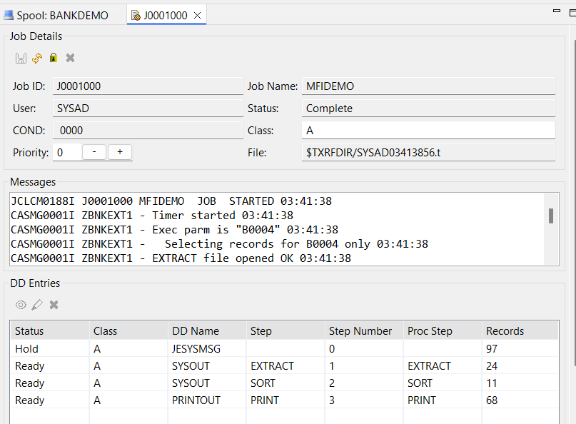\
    
3.  To see the details about a job, click the **Edit** icon. The details about the job are displayed in the **DD Details** window.

    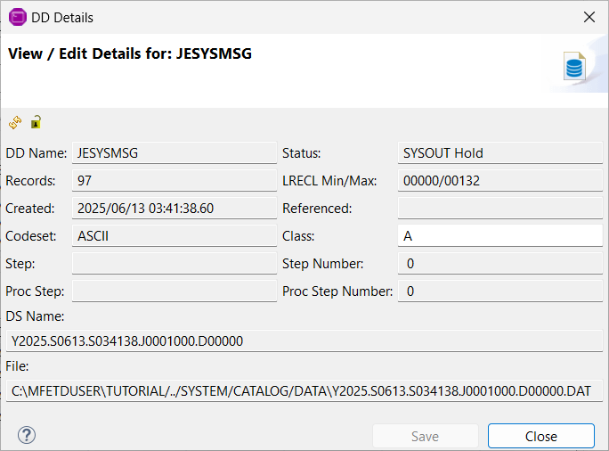

    In the **DD Entries** section, there are:

    -   Two **SYSOUT** results (one for the EXTRACT and one for the SORT). Double-click these and see the **SYSOUT Details** section.
    -   The **PRINTOUT** is the final printed results created by your job. Double-click **PRINTOUT** in the **DD Entries** section to see the results:
    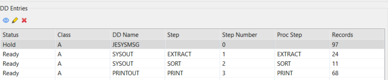

## Unit Testing the Online Application

[Back to Top](#overview)

In the previous step, Unit Testing the Batch Application, you used the BANKDEMO enterprise server. You will use it again for online testing.

As with JCL, execution of the jobs requires a previously configured enterprise server.

> **Important:** You need Enterprise Developer or Enterprise Developer for z Systems to execute the application. Running applications is not supported in Enterprise Developer Connect.

Before you proceed, ensure that the Secure Host Access (HA Cloud) service is running:
1. From the Windows **Start** menu open the Services application.

2. Navigate to the HA Cloud service and check whether its status is set to **Running**.

3. If it is not running, right-click the service and select **Start**.

**Executing the CICS Application**

The application requires that you use a 3270 Terminal Emulator. This tutorial uses the Rocket Software Secure Host Access (SHA) TN3270 emulator, but you can adapt the tutorial to suit your terminal emulator of choice. 

**Configuring the TN3270 Settings in the IDE**

To check the IDE preferences for the TN3270 emulator:

1.  In the IDE, click **Window \> Preferences**.
2.  Expand **Rocket Software \> Enterprise Server** and click **TN3270**.
3.  Ensure that **Enable display** and **Host Access for the Cloud** are selected.
4.  Click **Apply and Close**.

**Starting the Terminal Emulator**

-  In **Server Explorer**, right-click the **BANKDEMO** server and select **Show TN3270 Display**.

    This opens **Host Access for the Cloud** in your default browser and automatically establishes a 3270 terminal connection to the BANKDEMO server. You can see the starting page of the ES/MTO region BANKDEMO.

**Executing the Enterprise Server Demonstration**

1.  Type your login details, and press **Enter**.

    A suitable User ID is `b0001`. You can type anything as a **Password** - the field must not be empty though.

    

2.  Type `/` against **Display your account balances**.

    

3.  Press **Enter** to see the details for this customer.

    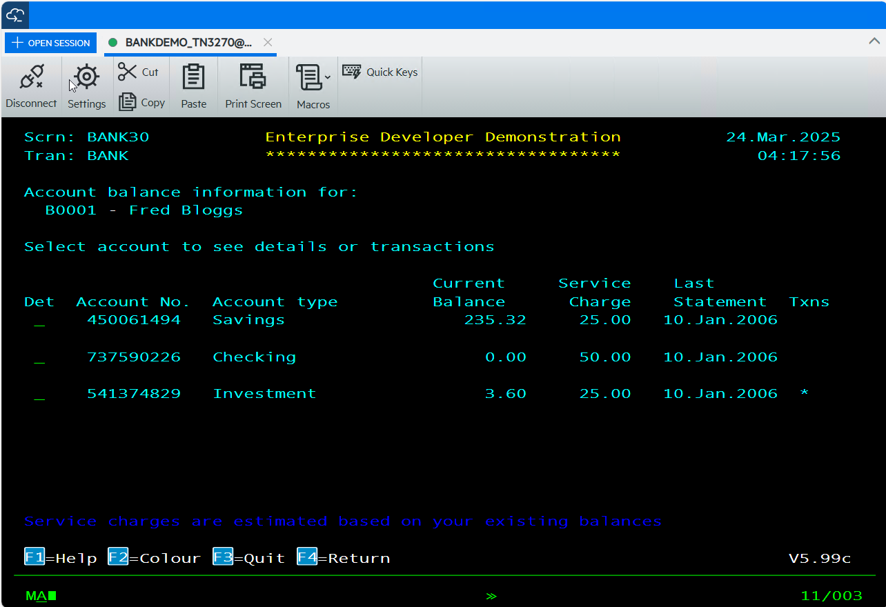

4.  You can explore this application further if you wish, or press **Ctrl + F2** to clear the screen and conclude the session.

If HA Cloud disconnects from the server, you can connect again manually as follows:

1.  Click **Open Session**, , in the toolbar of the **HACloud** window.
2.  In the **Available Sessions** dialog box, click the BANKDEMO server.    

    This connects the display to the BANKDEMO server and loads the start screen of the application.

3.  Follow the steps described earlier in this topic to execute the application in the **HACloud** view.

**Stopping the Enterprise Server**

You can stop the BANKDEMO server from within **Server Explorer**. You can leave it running if you want to continue this tutorial. To stop the server, right-click the **BANKDEMO** server and select **Stop**.

> **Note:** In production, enterprise servers are long-running processes that are usually run for many months without stopping and starting.

## Debugging the Batch Application

[Back to Top](#overview)

You will debug the batch Bankdemo application.

> **Important:** You need Enterprise Developer or Enterprise Developer for z Systems to execute the application. Running applications is not supported in Enterprise Developer Connect.

**Starting the Server**

If the enterprise server is not yet started:

1.  Open the **Server Explorer** view.

    If the view is not visible, click **Window** \> **Show View** \> **Other**. Select **Rocket Software** \> **Server Explorer** and then click **OK**.

2.  In **Server Explorer**, right-click the **BANKDEMO** server and then click **Start**.

    Wait until the server starts. If, in the list of servers in **Server Explorer**, BANKDEMO still has a red square next to it, this is a refresh delay.

**Viewing the Debug Configurations**

The project has two preconfigured debug configurations: a CICS Debug and a JCL Debug one. You will use these configurations to debug the batch and the online application.

1.  In the **Application Explorer** view, select the **Bankdemo** project and click **Run** \> **Debug Configurations**.
2.  In the left pane of the **Debug Configurations** dialog box, expand **COBOL Enterprise Server**.
3.  Click **CICS Debug**.
4.  Click the different tabs in the right pane to see what debug settings are enabled for this configuration. Note that this configuration will be used with the BANKDEMO server.
5.  Click **JCL Debug** under **COBOL Enterprise Server**.
6.  Click the different tabs in the right pane to see what debug settings are enabled for this configuration.
7.  Click **Close** to close the **Debug Configurations** dialog box without saving any changes.

**Starting the Debugger**

You can now start the debugger. It starts in the background until a program which is debuggable is triggered. To start the debugger:

1.  In the **Application Explorer** view, select the BANKDEMO project and from the menu bar click **Run** \> **Debug Configurations**.
2.  In the left pane of the **Debug Configurations** dialog, expand **COBOL Enterprise Server**.
3.  Click **JCL Debug** and click **Debug**.
4.  You might receive a message about opening the Debug perspective when it launches. If you do, click **Yes**.

    This opens a new **Debug** view, showing that the COBOL Debugger is waiting for an attachment.

    In addition, in the top right of the main screen, the view has changed from **Team Developer** to **Debug**:

    

    Click the respective icon to switch between the two perspectives.

5.  Click the **Team Developer** icon for now.
6.  In **Server Explorer**, right-click the BANKDEMO enterprise server, and click **Refresh**.

    The application is now waiting for an event that will trigger debugging.

**Simple Debugging**

You will look at some simple features inside the debugger. Start by submitting the JCL job:

1.  In the **Application Explorer** view, expand the **jcl** folder in your project.
2.  Right-click **ZBNKSTMT.jcl** and select **Submit JCL to associated Server**.
3.  Depending on what you have done before, you can receive a message to **Confirm Perspective Switch**. If you receive it, select **Remember my decision**, and click **Yes**. 

    If Eclipse does not switch to the Debug perspective automatically, click the **Debug** button, , in the right upper corner of the main Eclipse window to switch the perspective.

    This starts the debugger and opens `ZBNKEXT1.cbl` for debugging, with the execution point set on the first line of Procedure Division.

    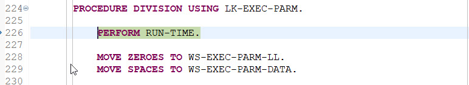

If you want to display the line numbers in the editor:

- Right-click in the left-most gray area of the editor, and click **Show Line Numbers**.

**Stepping Through the Code**

The highlighted line of code is the one the IDE will execute next.

1.  Press **F5** to execute the line.

    The PERFORM statement executes and takes you to the line starting with IF TIMER. You can also see that a **Variables** view is now open in the IDE showing the current value of a data item on the line of code which is about to be executed.

2.  Press **F5** slowly a few more times until you reach line 574 in the `ZBNKEXT1.cbl`. Watch the code as you step through it and notice how the values of the variables change inside the **Variables** view.

    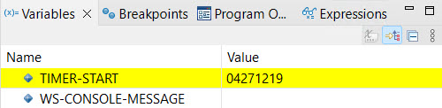

**Looking at Data Values**

1.  Scroll to line 283 of `ZBNKEXT1.cbl`.
2.  Hover over the WS-RECORD-COUNTER2 data item.

    This provides you with details of the location, the size, the format, the number of times the field is used in the program, and the current value of the data item.

    

3.  To change the value of WS-RECORD-COUNTER2, click the data item in the editor, right-click it, and click **Inspect item**.

    This opens a pop-up window showing the value of the data item.

    

4.  Click **Add to Expressions View** in the pop-up.

    This opens the **Expressions** tabbed view and adds the data item to it.

5.  On the row for WS-RECORD-COUNTER2, click the arrow next to the data item to expand it.
6.  In the repeated version of the field name, change the value from 00000 to 00006.

    

    The new value is used from this point.

**Running CSI Queries**

You can use the COBOL Source Information (CSI) functionality and its **Quick Browse** dialog to obtain information about your program when you are debugging it. This example shows details for data items starting WS-, such as the name, definition, and number of times each item occurs in the program.

1.  Click the **Quick Browse** button () on the toolbar to start the **Quick Browse** dialog box.
2.  Enter a simple query such as `WS-\*`. 

    

3.  Click **OK** to run the query.

    The results are shown in the **Search** view.

    

    To see more examples of CSI queries, start the **Quick Browse** dialog box again, and press **F1** to open the product help.

**Setting a Simple Breakpoint**

Check the **Breakpoints** view at the top right of the screen. Currently, there are no breakpoints set in the program. To set a simple breakpoint:

1.  Scroll down the code to line 171 of `ZBNKEXT1.cbl`.
2.  Double-click in the grey area to the left of this line or right-click in the same place, and select **Toggle Breakpoint**.

    

3.  Do the same for line 177.
    
    > **Note:** You can enable and disable the breakpoints from the **Breakpoints** view. 

    

4.  Use **F5** to step through the code and **F8** to execute it. Press **F8** now.

    The execution of the code stops at the first breakpoint.

5.  Press **F8** to resume the execution.

    You can see that `ZBNKEXT1.cbl` finishes and the debugger starts to debug the second program defined in the JCL.

    This program executes to completion and the job completes.

**Stop Debugging**

Although the job has completed, the debugger is still waiting for the next event. To stop debugging:

1.  Click **Run** \> **Terminate** or click the terminate button, , on the debugger toolbar.

2.  Finally, switch back to the Team Developer perspective.

## Debugging the Online Application

[Back to Top](#overview)

> **Important:** You need Enterprise Developer or Enterprise Developer for z Systems to execute the application. Running applications is not supported in Enterprise Developer Connect.

**Starting the Server**

If the enterprise server is not yet started, you should start it as follows:

1.  Click the **Server Explorer** tab in the IDE.

    If the tab is not visible, click **Window** \> **Show View** \> **Other**. Select **Rocket Software COBOL \> Server Explorer** and then click **OK**.

2.  In **Server Explorer**, right-click the **BANKDEMO** server and select **Start**.

    Wait until the server starts. If, in the list of servers in **Server Explorer** BANKDEMO still has a red square next to it, right-click it, and click **Refresh**.

**Starting the Debugger**

You can now start the debugger. It starts in the background until a program which is debuggable is triggered. 

To start the debugger:

1.  In the **Application Explorer** view, select the **Bankdemo** project and from the menu bar, select **Run** \> **Debug Configurations**.
2.  In the left pane of the **Debug Configurations** dialog box, expand **COBOL Enterprise Server**.
3.  Click **CICS Debug** and then click **Debug**.
4.  You might receive a message about opening the Debug perspective. Click **Yes**.

    This opens a new **Debug** pane, showing the debugger that is waiting for an attachment:

    

    In addition, in the top right corner of the main screen, the perspective has changed from **Team Developer** to **Debug**:  .

    The **TN3270 Connection Properties** dialog box opens.

5.  Click **Connect** to accept the connection details.

    This opens the **HACloud** terminal emulator, connects the display to the BANKDEMO enterprise server, and loads the start screen of the application.

    Your Eclipse application is now waiting for an event to happen that will trigger the debugging.

6.  In the toolbar, click the downward arrow next to the debug  icon.

    You can see that the preconfigured CICS and JCL debug configurations are now listed in the menu.

10. In the **HACloud** view, press **Ctrl + F2** to clear the screen of the emulator.
11. Enter transaction id BANK, and press **Enter**.

    The program SBANK00P starts to execute on line 105.

    

**Simple Debugging**

You use the same features as previously to debug the application.

1.  Click **Run** \> **Step Into** or press **F5** a few times to go through executing the code.
2.  Watch how the values of the variables shown in the **Variable** view change.

    

**Stop Debugging**

1. Click **Run** \> **Terminate** or click the terminate button, , on the debugger toolbar to stop debugging.


2. Finally, click the **Team Developer** perspective button, , to switch back to editing your application.

This concludes this set of tutorials that introduce Enterprise Developer.

> **Note**: You should re-enable Enterprise Server security if you have not already done so. See *To Recreate the Default Enterprise Server Security Configuration* in the product documentation for steps on how to re-enable security. 

[Back to Top](#overview)
